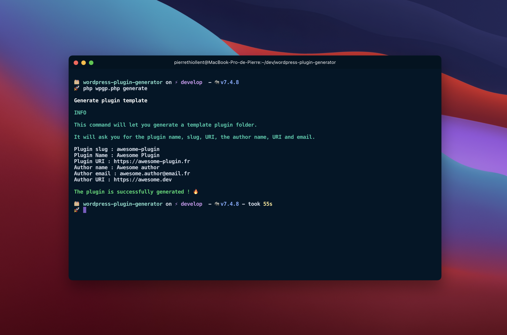

# WordPress template plugin generator

This app is a PHP CLI for generating WordPress plugin template based on WordPress Plugin Boilerplate by Tom McFarlin [(wppb.io)](https://wppb.io).



## Requirements 🔧

- PHP (^7.4)
- Composer

### Installation 🔄

```shell
git clone
```

```shell
cd <project>
```

```shell
composer install
```

### Use 🚀

Generate a plugin

```php
php wpgp.php generate
```

The generated plugin will be available in /project/source/plugin-slug
